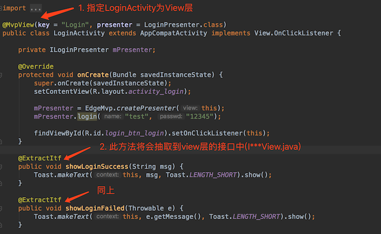
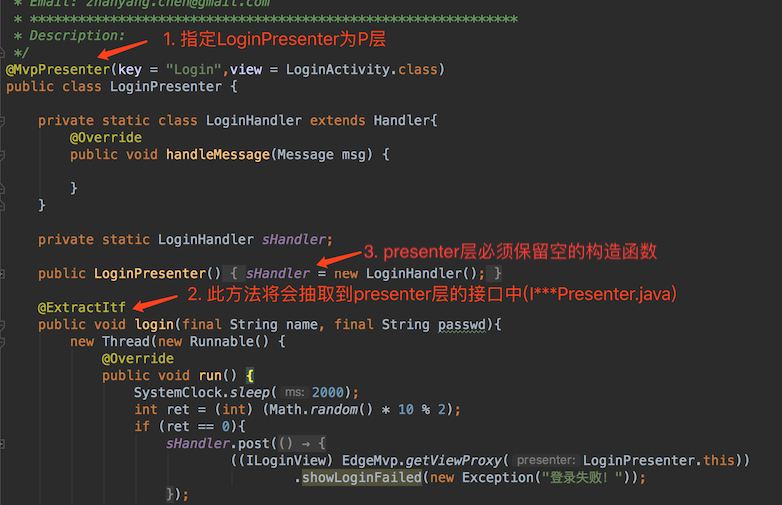

# EdgeMvp
一个MVP架构利器。自动生成接口文件，且不需要实现接口。

- View层使用@MvpView注解，标注为view。
- Presenter层使用@MvpView注解，标注为presenter。
- 使用@ExtractItf注解标注方法，此方法将会被抽取到接口中。

##### 使用方法：
1. @MvpView使用

    

2. @MvpPresenter使用

    

3. 点击按钮，自动生成代码。(PS:同步按钮不会生成代码)

4. view层中创建presenter对象。

    ```java
    private ILoginPresenter mPresenter;

    .....

    mPresenter = EdgeMvp.createPresenter(this);
    mPresenter.login("test", "12345");
    ```

5. presenter层中获取view对象。
    ```java
    ((ILoginView) EdgeMvp.getViewProxy(LoginPresenter.this));
    ```

##### 不足的地方：

- 注解标注完，需要编译才能生成生成需要的文件。
- createPresenter()、getViewProxy()需要生成代码后，调用才会有效，并且需要强转。

##### 结束：

该项目还存在不足的地方，各位大神有什么好的想法或者建议，望不吝赐教。

最后，都看这里了，给点个星呗。(^∀^)

##### Email: zhanyang.chen@gmail.com

##### [License](./LICENSE)

    Licensed under the Apache License, Version 2.0 (the "License");

    you may not use this file except in compliance with the License.

    You may obtain a copy of the License at

        http://www.apache.org/licenses/LICENSE-2.0

    Unless required by applicable law or agreed to in writing, software

    distributed under the License is distributed on an "AS IS" BASIS,

    WITHOUT WARRANTIES OR CONDITIONS OF ANY KIND, either express or implied.

    See the License for the specific language governing permissions and

    limitations under the License.
